# 🖼️ Image Captioning — Transfer Learning vs. Training from Scratch

> **Module : Apprentissage | IFI-VNU (Institut Francophone International)**  
> Auteurs : Wenchel RIDORE & Frédéric HABONIMANA  
> Prof. : Dr. CISSOKO Mamadou Ben Hamidou

---

## 📌 Description

Ce projet compare deux approches de **génération automatique de descriptions d'images (Image Captioning)** :

| Approche | Encodeur | Entraînement |
|---|---|---|
| **Task A** | ResNet-50 (ImageNet) | Transfer Learning |
| **Task B** | Custom CNN (5 blocs) | From Scratch |

Les deux modèles utilisent une architecture **Encoder-Decoder** avec :
- Décodeur **LSTM**
- Mécanisme d'**attention additive de Bahdanau**
- Dataset : **Flickr8k** (8,000 images, 5 captions/image)

---

## 📊 Résultats

| Métrique | Task A (ResNet-50) | Task B (Custom CNN) |
|---|---|---|
| **BLEU-1** | 0.3301 | 0.2787 |
| **BLEU-4** | **0.0695** | 0.0444 (+56.5% pour A) |
| **Val Loss** | **2.7653** | 2.8924 |
| Gap train/val | **0.42** | 0.60 |
| Hallucinations | Rares | Fréquentes |

> ✅ **Conclusion** : Le transfer learning surpasse l'entraînement from scratch sur tous les indicateurs, notamment **+56.5% sur BLEU-4**.

---

## 🏗️ Architecture

### Task A — ResNet-50 + LSTM + Attention
- **Encodeur** : ResNet-50 préentraîné (ImageNet), couches `avgpool` et `fc` supprimées → features spatiales `7×7×2048`, poids gelés
- **Décodeur** : LSTM (hidden=512) + Attention Bahdanau sur 49 régions
- **Paramètres** : 34.9M total / 11.5M entraînables

### Task B — Custom CNN + LSTM + Attention
- **Encodeur** : 5 blocs `Conv2D → BN → ReLU → MaxPool` + GAP layer → features `7×7×512`
- **Décodeur** : Identique à Task A (adapté pour dim=512)
- **Paramètres** : 7.5M (100% entraînables, end-to-end)

---

## 📈 Visualisations

### Courbes d'apprentissage

| Task A (ResNet-50) | Task B (Custom CNN) |
|---|---|
| 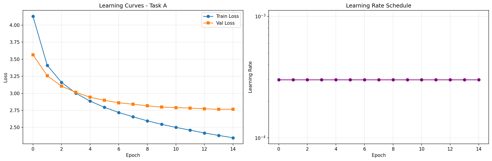 | 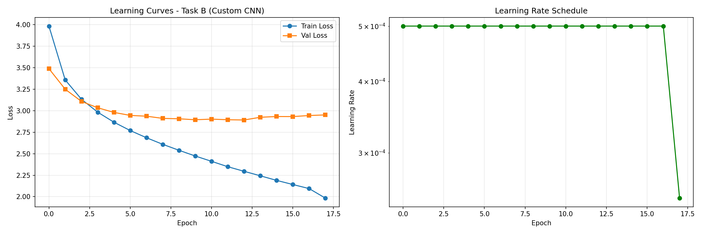 |

### Attention Heatmaps

**Task A — Attention focalisée et précise :**

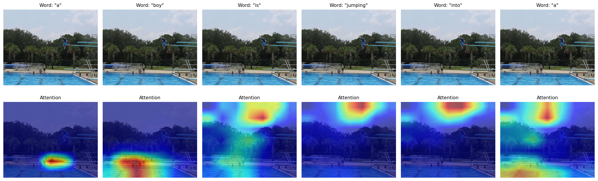
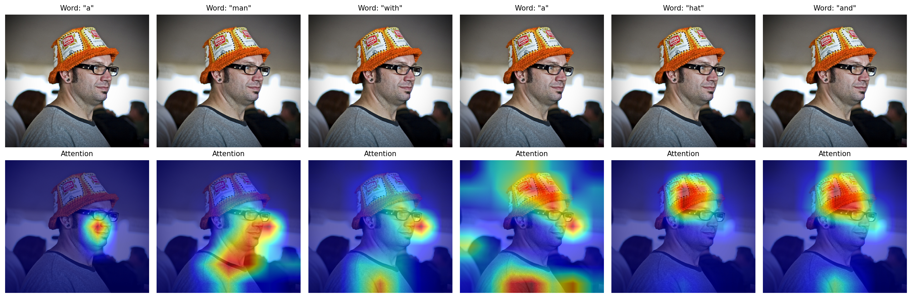
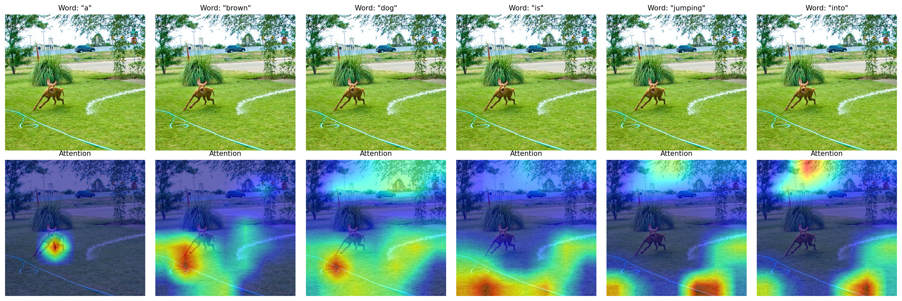

**Task B — Attention diffuse et moins discriminative :**

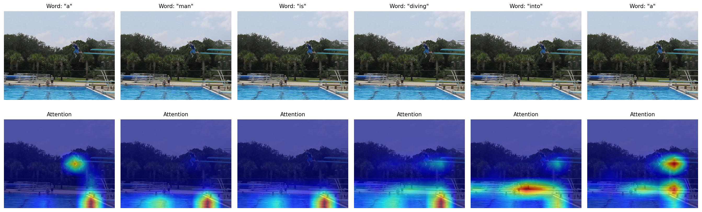
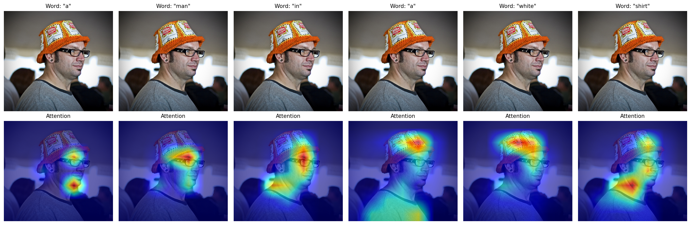
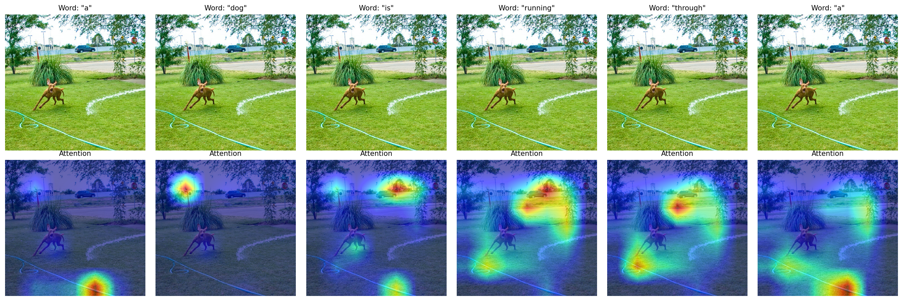

### Grad-CAM (Custom CNN — Task B, couche conv5)

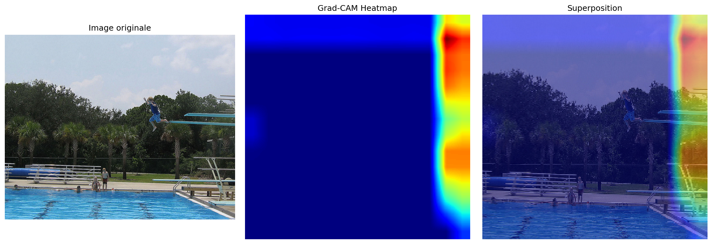
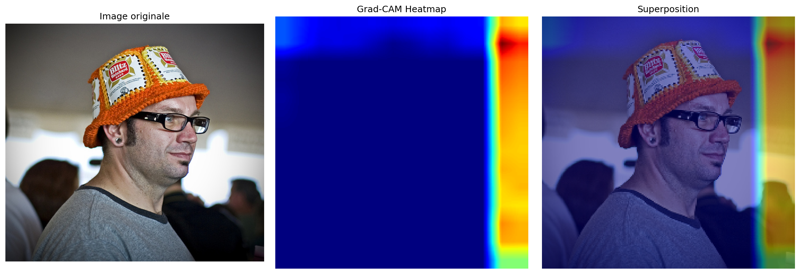
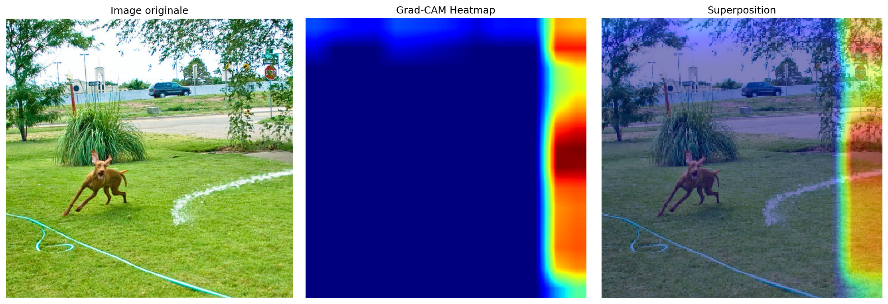

### Matrices de Confusion (word-level, Top 20 mots)

| Task A (ResNet-50) | Task B (Custom CNN) |
|---|---|
| 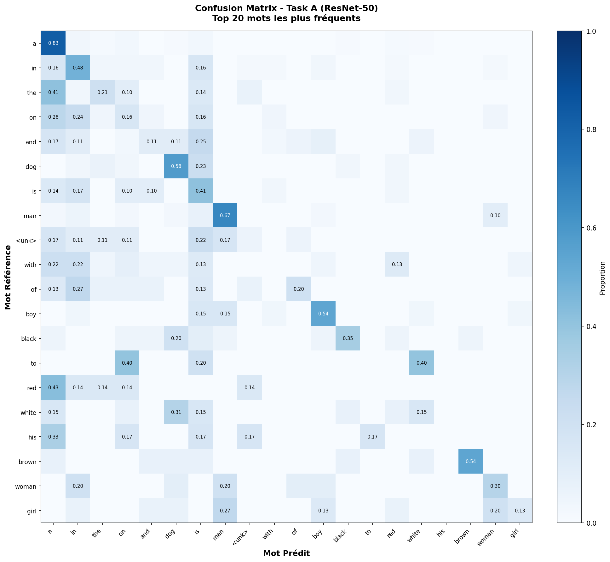 | 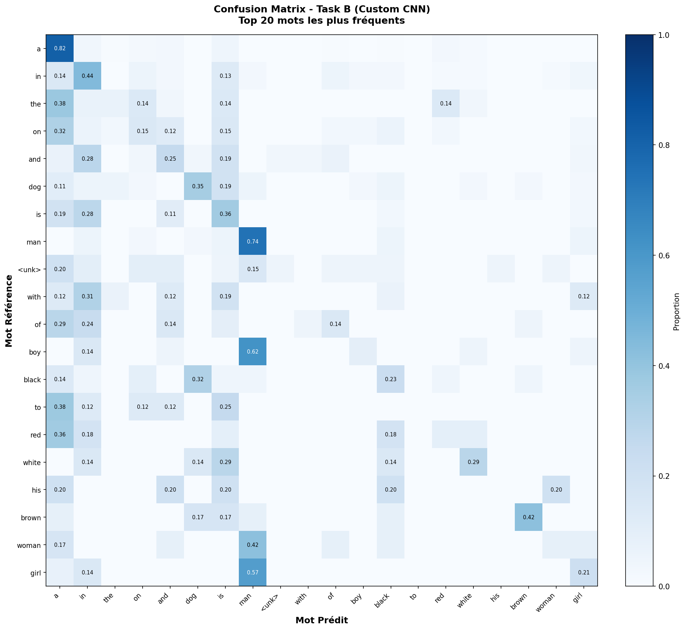 |

### Galerie de Résultats

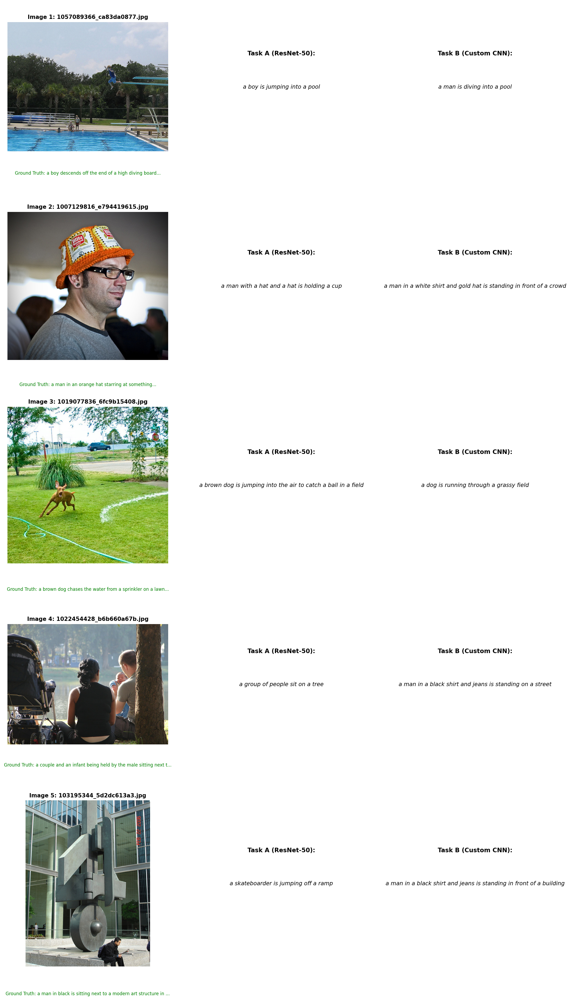

---

## 📁 Structure du projet

```
image-captioning-transfer-learning/
│
├── README.md
├── requirements.txt
├── .gitignore
│
├── notebooks/
│   └── TP2_ImageCaptioning_Groupe3.ipynb
│
└── resultats/
    ├── training_curves/
    │   ├── training_curves_taskA.png
    │   └── training_curves_taskB.png
    ├── attention_heatmaps/
    │   ├── taskA/ (3 exemples)
    │   └── taskB/ (3 exemples)
    ├── gradcam/ (3 exemples)
    ├── confusion_matrices/
    │   ├── confusion_matrix_taskA.png
    │   └── confusion_matrix_taskB.png
    └── gallery/
        └── result_gallery.png
```

> ⚠️ **Note** : Les poids des modèles entraînés (`.pt`) ne sont pas inclus dans ce dépôt en raison de leur taille. Le notebook est configuré pour Google Colab avec sauvegarde sur Google Drive.

---

## ⚙️ Installation & Utilisation

```bash
git clone https://github.com/wenrid/image-captioning-transfer-learning.git
cd image-captioning-transfer-learning
pip install -r requirements.txt
```

Ouvrir le notebook sur **Google Colab** (recommandé — GPU requis) :

1. Uploader le notebook sur Colab
2. Monter Google Drive pour sauvegarder les modèles
3. Télécharger Flickr8k et le placer dans Drive
4. Exécuter les cellules dans l'ordre

---

## 🗂️ Dataset

**Flickr8k** — [Télécharger ici](https://www.kaggle.com/datasets/adityajn105/flickr8k)

| Split | Images | Captions |
|---|---|---|
| Train | 6,000 | 30,000 |
| Dev | 1,000 | 5,000 |
| Test | 1,000 | 5,000 |

---

## 🔬 Hyperparamètres

| Paramètre | Task A | Task B |
|---|---|---|
| Optimizer | Adam (lr=3e-4) | Adam (lr=5e-4) |
| Batch size | 32 | 32 |
| Dropout | 0.5 | 0.5 |
| Gradient Clipping | 5.0 | 5.0 |
| Epochs | 15 | 18 (early stopping) |
| Scheduler | ReduceLROnPlateau | ReduceLROnPlateau |

---

## 📚 Références

- Xu et al. (2015). *Show, Attend and Tell*. ICML.
- He et al. (2016). *Deep Residual Learning for Image Recognition*. CVPR.
- Bahdanau et al. (2015). *Neural Machine Translation by Jointly Learning to Align and Translate*. ICLR.
- Selvaraju et al. (2017). *Grad-CAM*. ICCV.
- Papineni et al. (2002). *BLEU*. ACL.

---

## 👥 Auteurs

- **Wenchel RIDORE** — IFI-VNU, Promotion 28
- **Frédéric HABONIMANA** — IFI-VNU, Promotion 28

---

*Institut Francophone International — Vietnam National University, Hanoi*
